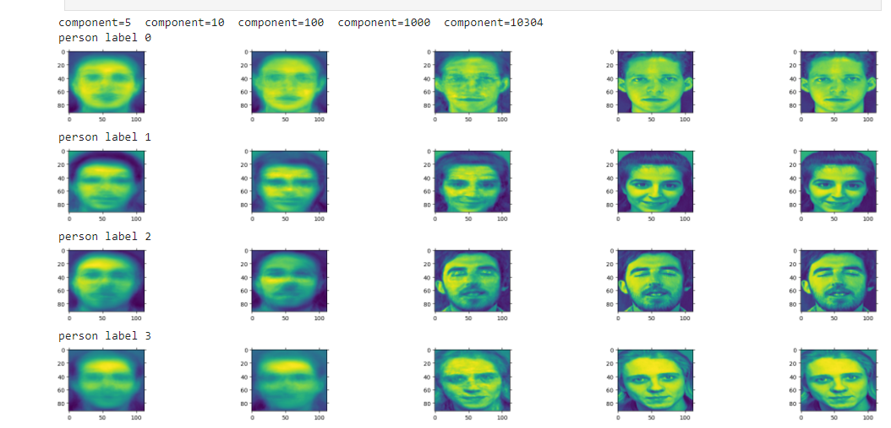
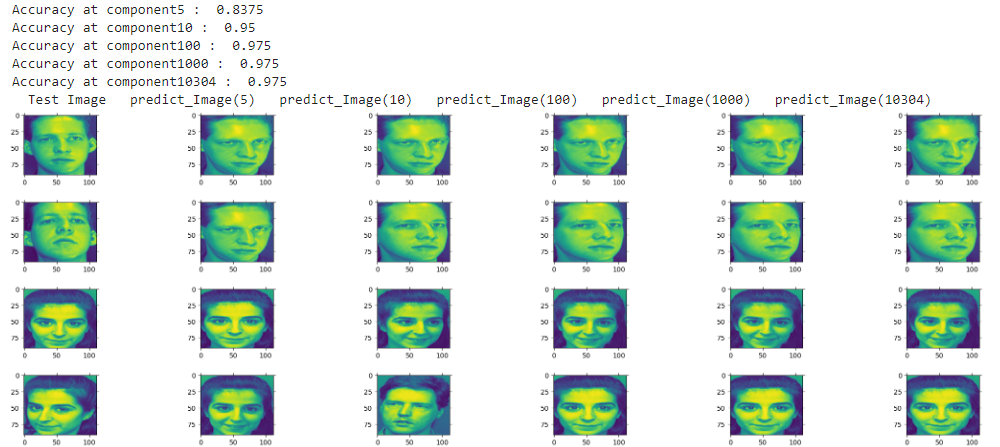

# Face-Recognition-using-Principal-Component-Analysis
SMAI-Mini-Project || Face Recognition using Principal Component Analysis
### Objective:
This project requires you to create a basic facial recognition system using a technique called principal component analysis (PCA) 
by projecting the face images on the feature space (face space) which best
represents the variations among distinct faces. The face space is defined as the
“Eigenfaces", which are the eigenvectors of the set of faces.

The goal of implementing this system is to recognize a person's face by comparing it to a pre-existing database of faces, and identifying the closest match.

Link to paper on Eigenfaces: [https://sites.cs.ucsb.edu/~mturk/Papers/mturk-CVPR91.pdf](https://sites.cs.ucsb.edu/~mturk/Papers/mturk-CVPR91.pdf)

### About the dataset:  
The AT&T face dataset contains a set of grayscale face images with dimensions 92x112. The images are organised in 40 directories (one for each subject), which have names of the form sX, where X indicates the subject number (between 1 and 40). In each of these directories, there are ten different images of that subject, which have names of the form Y.pgm, where Y is the image number for that subject (between 1 and 10). These 10 images per person are taken at different times, varying the lighting, facial expressions (open / closed eyes, smiling / not smiling) and facial details (glasses / no glasses). All the images were taken against a dark homogeneous background with the subjects in an upright, frontal position (with tolerance for some side movement). <b>Link:</b> [https://git-disl.github.io/GTDLBench/datasets/att_face_dataset/](https://git-disl.github.io/GTDLBench/datasets/att_face_dataset/)

## PCA for Facial Recognition

Facial recognition systems often utilize Principal Component Analysis (PCA) as a dimensionality reduction technique, extracting eigenfaces to capture essential facial features. This process simplifies the recognition task by reducing data dimensionality.

## Steps for PCA in Facial Recognition:

### 1. Data Collection and Preprocessing
- Gather a dataset of face images.
- Preprocess images to enhance quality and uniformity.

### 2. Computing the Covariance Matrix
- Calculate the covariance matrix of preprocessed face images.

### 3. Obtaining Eigenvectors and Eigenvalues
- Derive eigenvectors and eigenvalues from the covariance matrix.

### 4. Selecting Principal Components (Eigenfaces)
- Choose eigenfaces corresponding to significant eigenvalues.

### 5. Reducing Dimensionality and Projecting Face Images
- Project original face images onto the eigenface basis to reduce dimensionality.

### 6. Comparing and Evaluating Recognition Accuracies
- Use reduced-dimensional representations for facial recognition.
- Compare and evaluate system recognition accuracies.

## Results

In the PCA process, a notable observation emerges regarding the relationship between the number of components (eigenfaces) and the clarity of reconstructed faces. Increasing the components enhances eigenface clarity, making them more visually recognizable. Conversely, fewer components result in more abstract and less defined eigenfaces, emphasizing the need for an optimal component count.

Furthermore, facial recognition algorithm accuracy improves with more components. Increased eigenfaces enable capturing intricate facial details, enhancing discrimination and recognition. Striking a balance between component count and computational complexity is crucial, considering higher components may demand more computational resources.

Refer to the provided Jupyter Notebook for a visual comparison of reconstructed faces and recognition accuracies at different component counts, offering insights into the impact on eigenface clarity and overall recognition system accuracy.

Result sample on diff-diff compoment

